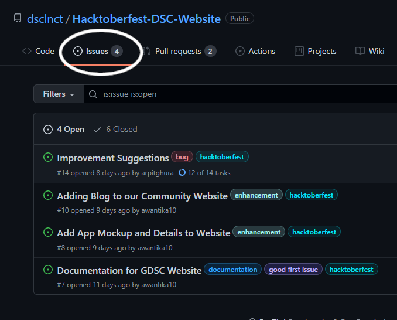
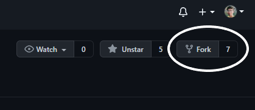
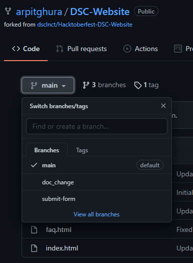

# Contributing Guidelines  
  
This documentation contains a set of guidelines to help you during the contribution process.

We are happy to welcome all the contributions from anyone willing to improve this project. Thank you for helping out and remember, **no contribution is too small.** 
- Join the discord channel for regular updates.
- Each participant/contributor will be assigned **2 issues (max)** at a time to work.
- Participants are expected to follow project guidelines and coding style.
- Participants/contributors have to give an update about their work in every **3 days** while completing issues. If not then the issue will be assigned to other.
- Participants/contributors have to **comment** on issues they would like to work on, and mentors will assign you. Direct PRs for Open to all issues .
- Issues will be assigned on a **first-come, first-serve basis**.
- Participants/contributors can also **open their issues**, but it needs to be verified and labelled by a mentor.
- Before opening a new issue, please **check** if it is already created or not.
- Pull requests will be merged after being **reviewed by a mentor**.
- Create a pull request from a **branch** other than `main` ,that means you have to create a new branch for every pull request.
- It might take a day to review your pull request. Please have patience and be nice.
- We all are here to learn. You are allowed to make mistakes. That's how you learn, right!

- **MAKE SURE TO OPEN A DRAFT PR AS SOON AS YOU START WORKING ON AN ISSUE AND KEEP COMMITING TO IT SO THAT WE CAN KNOW THAT YOU ARE WORKING ON THAT PARTICULAR ISSUE**

- Pull Requests review criteria:
  - Please fill the **PR template** properly while making a PR.
  - Example of the **PR template**
  
  
  - You must add your designs file into the respective **folders**.
  - Your work must be **original**, designed/written by you not copied from other resources.
  - You must **comment** on your code where necessary.
  - For **frontend changes**, kindly share screenshots and work samples of your work before sending a PR.

- For any queries or discussions, please drop a message in our **discord server**.

# Submissions
`(Use "Fixes #Issue_Number" in a pull request as mentioned in the PR template and please fill the PR details while creating a pull request )`


### Code submission
All the information would be given in the issue.

### Documentation submission
All the information would be given in the issue. 
  
# How to start
Below you will find the process and workflow used to review and merge your changes.  

## Step 0 : Find an issue  🔍
- Take a look at the Existing Issues or create your **own** Issues!  
- Wait for the Issue to be assigned to you after which you can start working on it.  
- Note : Every change in this project should/must have an associated issue.


  
## Step 1 : Fork the Project 🍴 and clone it
- Fork this Repository. This will create a Local Copy of this Repository on your Github Profile. Keep a reference to the original project in `upstream` remote.  



 
- After this go to your terminal and clone this project on your desktop( git should be installed before - [link](https://git-scm.com/) ).
  
```  
$ git clone https://github.com/<your-username>/Hacktoberfest-DSC-Website 
$ cd <repo-name>  
$ git remote add upstream https://github.com/dsclnct/Hacktoberfest-DSC-Website 
```  
- Update your forked repo before working.  
```  
$ git remote update  
$ git checkout <branch-name>  
$ git rebase upstream/<branch-name>  
```  
## Step 2 : Branch  🔖
Create a new branch. Use its name to identify the issue you are addressing.  




```  
# It will create a new branch with name Branch_Name and switch to that branch. 
$ git checkout -b branch_name  
```  

## Step 3 : Work on the issue assigned  📕
- Work on the issue(s) assigned to you.   
- Add all the files/folders needed.  
- After you've made changes or made your contribution to the project add changes to the branch you've just created by using terminal:  
```  
# To add all new files to branch Branch_Name  
$ git add .  
# To add only a few files to Branch_Name
$ git add <some files>
```
- Using GitHub:


  
## Step 4 : Commit  
- To commit give a descriptive message for the convenience of reviewer by using terminal:  
```
# This message get associated with all files you have changed. 
$ git commit -m "message"  
```
- Using GitHub

  

### Commit message guidelines
- Each commit message consists of a header, a body and a footer. The header has a special format that includes a type, a scope and a subject:
```
<type>(<scope>): <subject>
<BLANK LINE>
<body>
<BLANK LINE>
<footer>
```
Any line of the commit message cannot be longer than 100 characters! This allows the message to be easier to read on GitHub as well as in various git tools.

### Example commit message
```
feat(Profile): display QR code
fetch the QR code from API and display it on the Profile page (ProfileFragment.kt)
fixes #1234
```
A good rule of thumb for the commit message is to have a present tense verb, followed by whatever it is you're doing in as much detail as possible in 50 chars. Capitalize words correctly and follow general English.
### For more details, visit
- [Git commit message guidelines](http://karma-runner.github.io/0.13/dev/git-commit-msg.html)
- [Writing Good Commit Messages: A Practical Git Guide](https://www.freecodecamp.org/news/writing-good-commit-messages-a-practical-guide/)
 
## Step 5 : Work Remotely  
- Now you are ready to work in the remote repository.  
- When your work is ready and complies with the project conventions, upload your changes to your fork:  
  
```  
# To push your work to your remote repository.  
$ git push -u origin <branch_name>  
```  
- Here is how your branch will look.  


  
## Step 6 : Pull Request  🎣
- Go to your repository in browser and click on compare and pull requests. Then add a title and description to your pull request that explains your contribution. 
- Compare


- Create pull request
 

- Voila! Your Pull Request has been submitted and will be reviewed by the moderators and merged.🥳  
  
## Need more help?🤔  
You can refer to the following articles on basics of Git and Github and also contact the Project Mentors, in case you are stuck:  
- [Forking a Repo](https://help.github.com/en/github/getting-started-with-github/fork-a-repo)  
- [Cloning a Repo](https://help.github.com/en/desktop/contributing-to-projects/creating-an-issue-or-pull-request)  
- [How to create a Pull Request](https://opensource.com/article/19/7/create-pull-request-github)  
- [Getting started with Git and GitHub](https://towardsdatascience.com/getting-started-with-git-and-github-6fcd0f2d4ac6)  
- [Learn GitHub from Scratch](https://lab.github.com/githubtraining/introduction-to-github)  
- [Join Discord Server](https://discord.gg/KUWxHpZG8d) 
  
## Tip from us😇  
It always takes time to understand and learn. So, do not worry at all. We know **you have got this**!💪